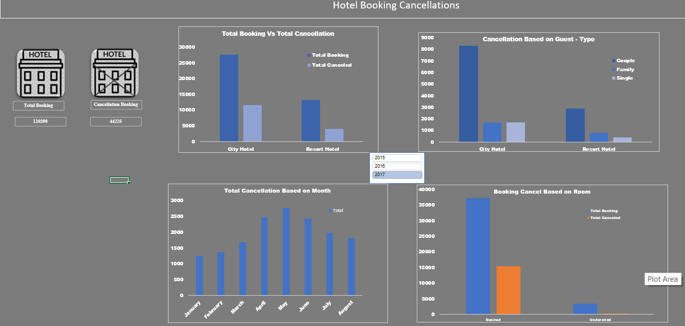
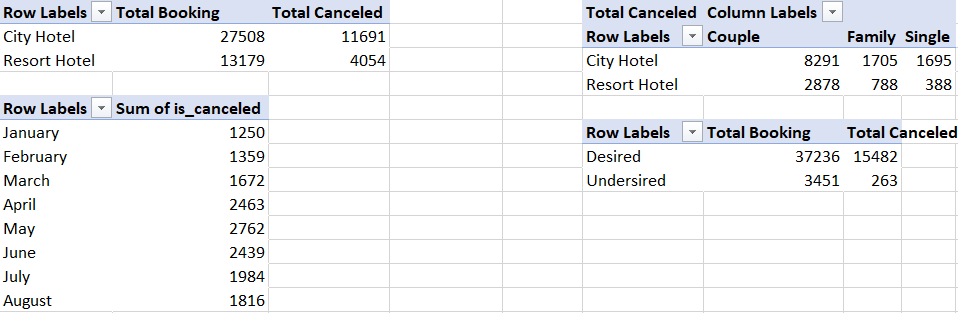

# Data-Analytics Project

# Project 1: hotel Reservation Cancellation 
Dashboard Image

Pivot Table Image

# Project 2: Coffee Shops Sales
Dashboard Image

Pivot tables Image

# Project 3: Vrinda Store Sales
Dashboard Image:

Pivot Table image:

Conclusion to improve Vrinda sales stores:
Target women customer of age group (30-49 yrs) living in Maharashtra, Karnataka and Uttar Pradesh by showing ads/offers/coupons avaiable on Amazon, Flipkart and Myntra

# Project 4: HR Analytics
Dashboard Image:

Conclusion:
Employee who work on Laboratory Technician are attrition rate is high, due to less salary.

